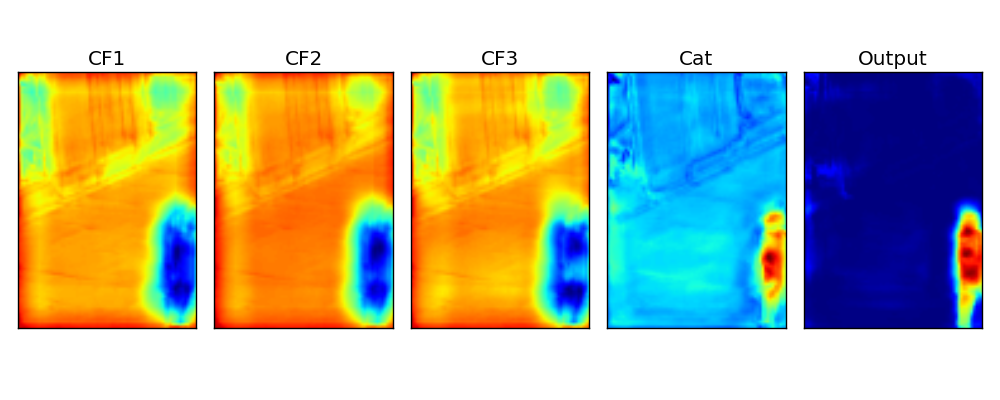
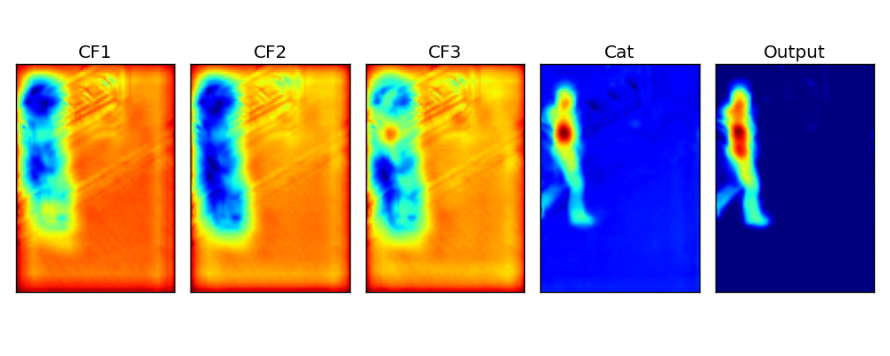
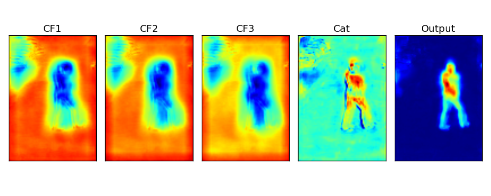
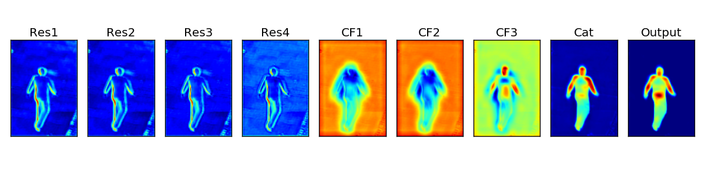
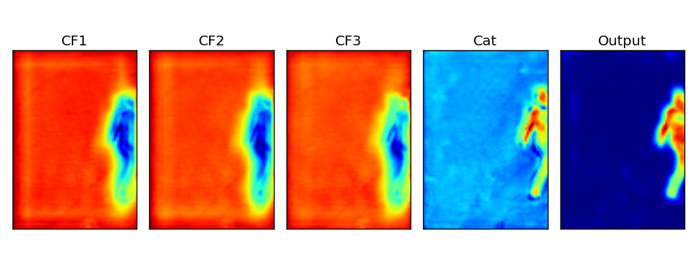
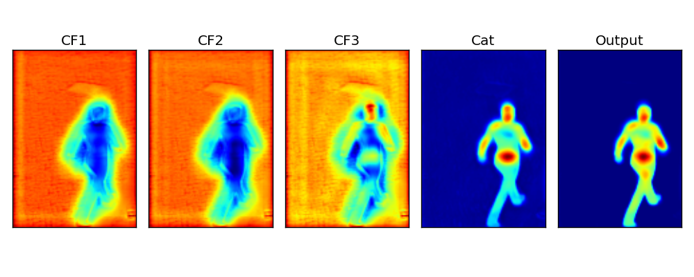
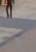
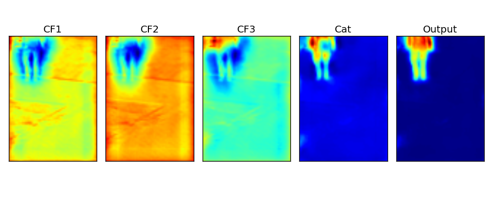
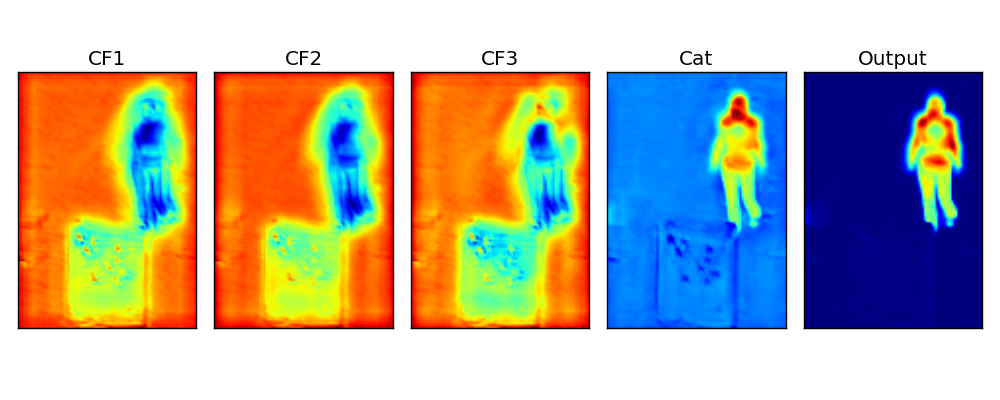
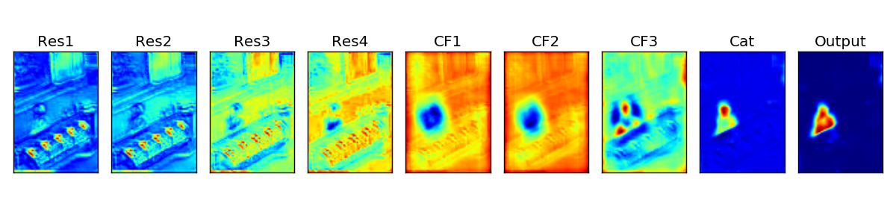

# Activation maps visualization 

## Settings
- dataset: towncenter (10 locations)
- Given a test image, activation maps at every block of ScenePoseNet are presented. 
- 9 activation maps (Res1, Res2, Res3, Res4, CF1, CF2, CF3, Cat, Output). Please refer to Figure 4 of the paper.

## Notes

## Visualizations
<table>
    <tr>
        <td> input image </td>
        <td> activation maps </td>
    </tr>
    <tr>
        <td>  </td>
        <td>  </td>
    </tr>
    <tr>
        <td>  </td>
        <td>  </td>
    </tr>
    <tr>
        <td>  </td>
        <td>  </td>
    </tr>
    <tr>
        <td>  </td>
        <td>  </td>
    </tr>
    <tr>
        <td>  </td>
        <td>  </td>
    </tr>
    <tr>
        <td>  </td>
        <td>  </td>
    </tr>
    <tr>
        <td>  </td>
        <td>  </td>
    </tr>
    <tr>
        <td>  </td>
        <td>  </td>
    </tr>
    <tr>
        <td>  </td>
        <td>  </td>
    </tr>
    <tr>
        <td>  </td>
        <td>  </td>
    </tr>
    
</table>

