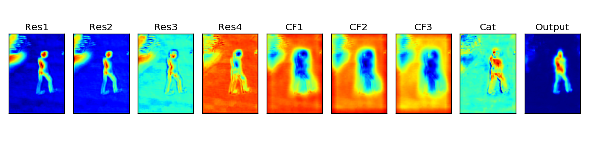

# Activation maps visualization 

## Settings
- dataset 1: towncenter
- 5 activation maps given a test image (CF1, CF2, CF3, Cat, Output; Please refer to Figure 4 of the paper)
- for 10 locations 

## Notes

## Visualizations
<table>
    <tr>
        <td> input image </td>
        <td> activation maps </td>
    </tr>
    <tr>
        <td> </td>
        <td>  </td>
    </tr>
    <tr>
        <td> </td>
        <td>  </td>
    </tr>
    <tr>
        <td> </td>
        <td>  </td>
    </tr>
    
</table>

