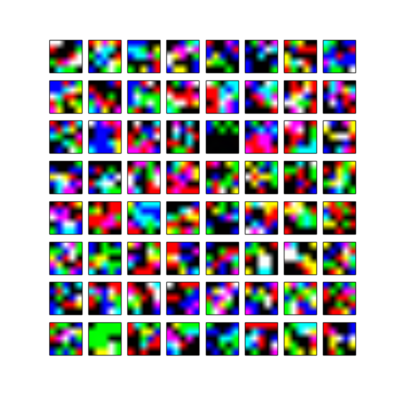
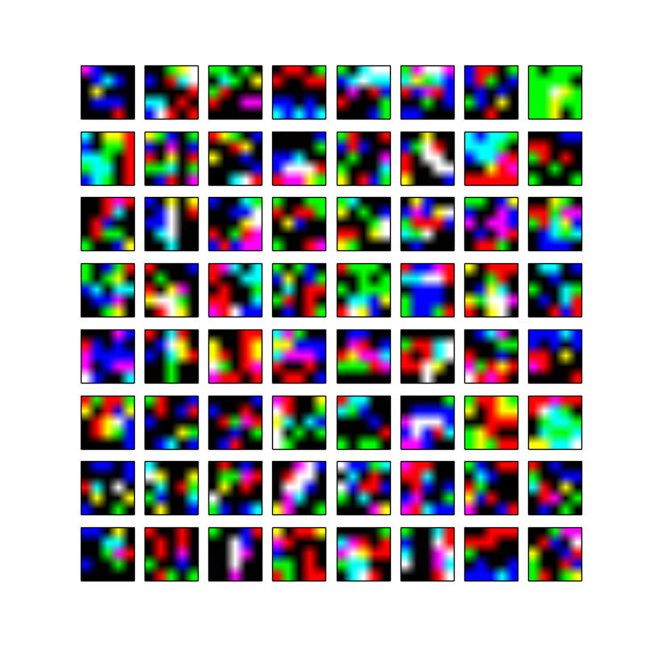
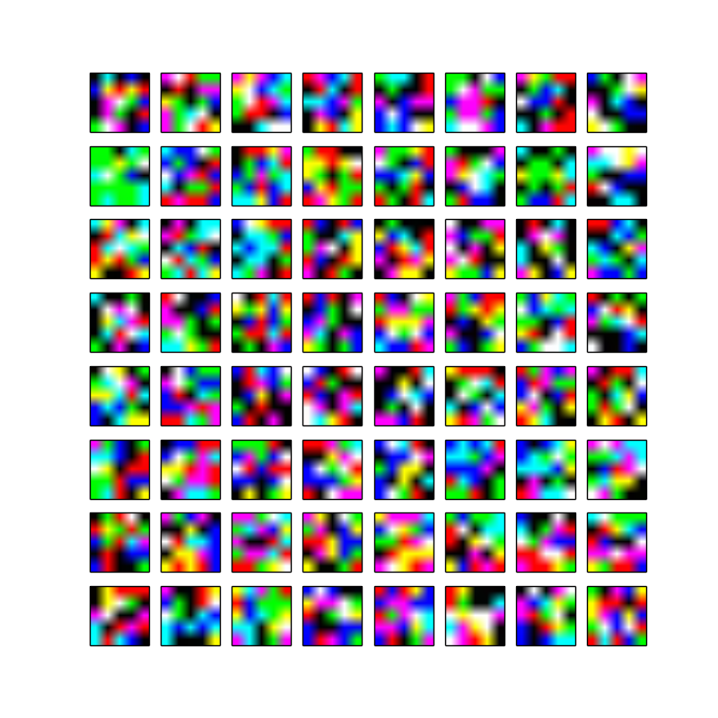
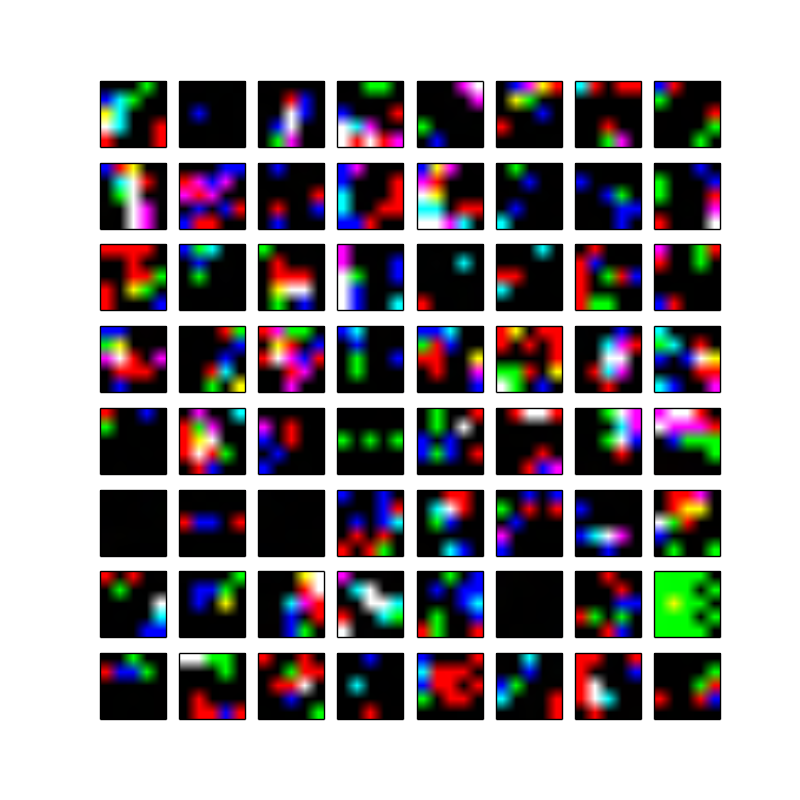
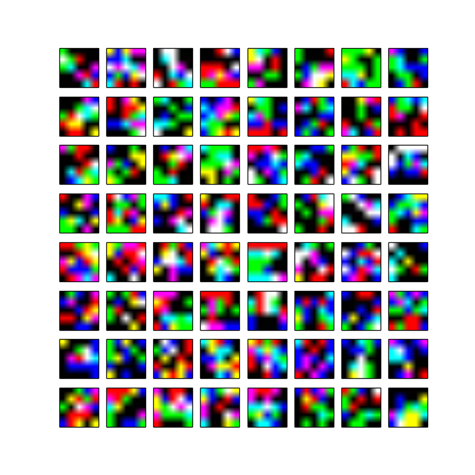
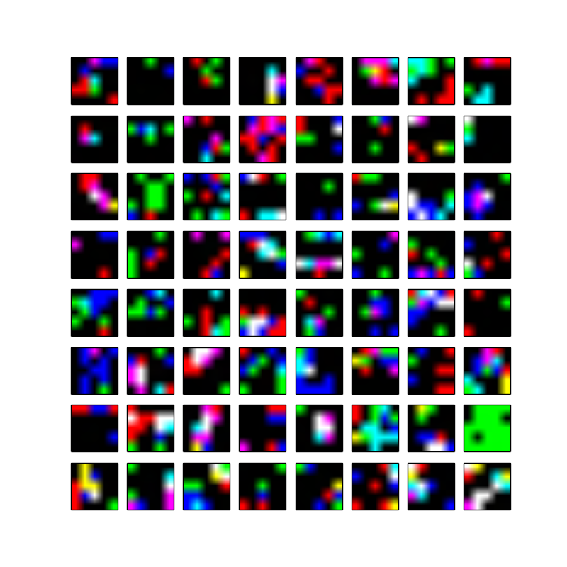
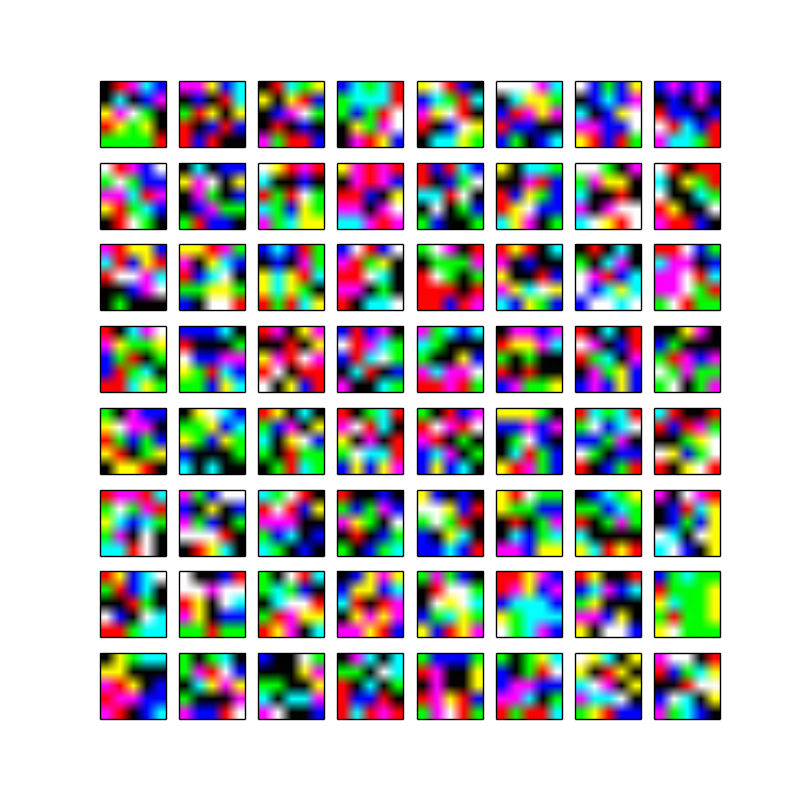
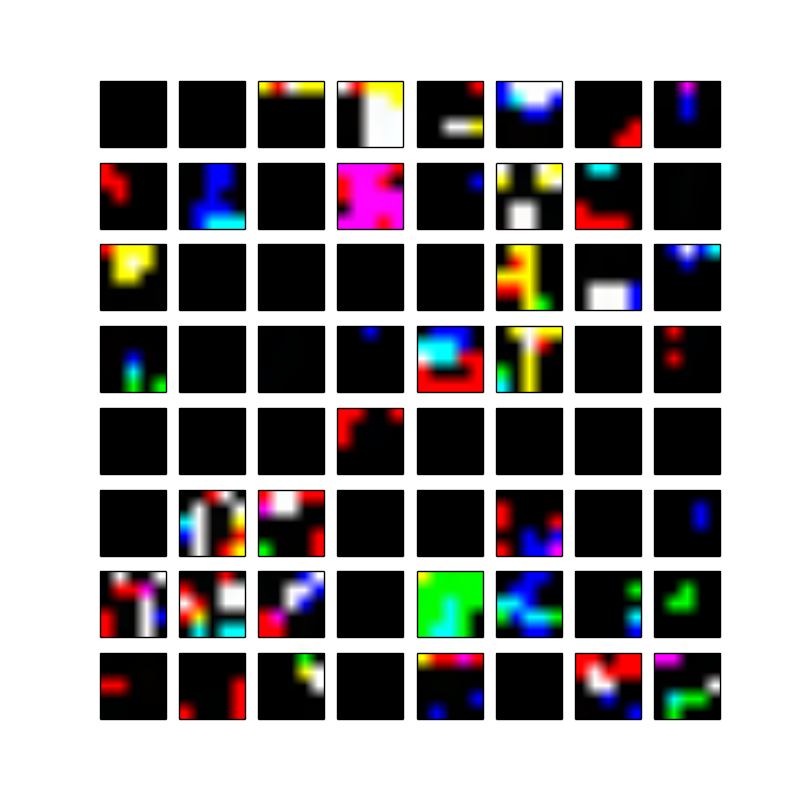
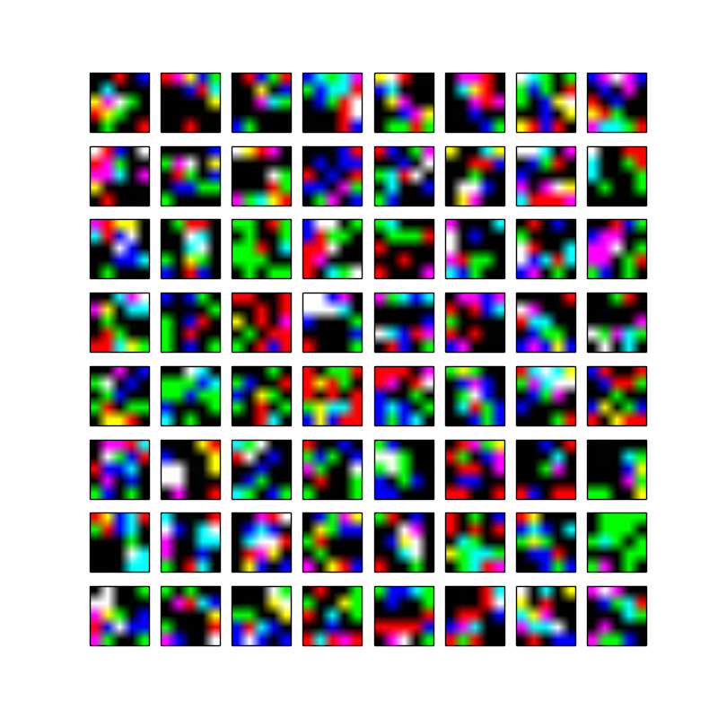
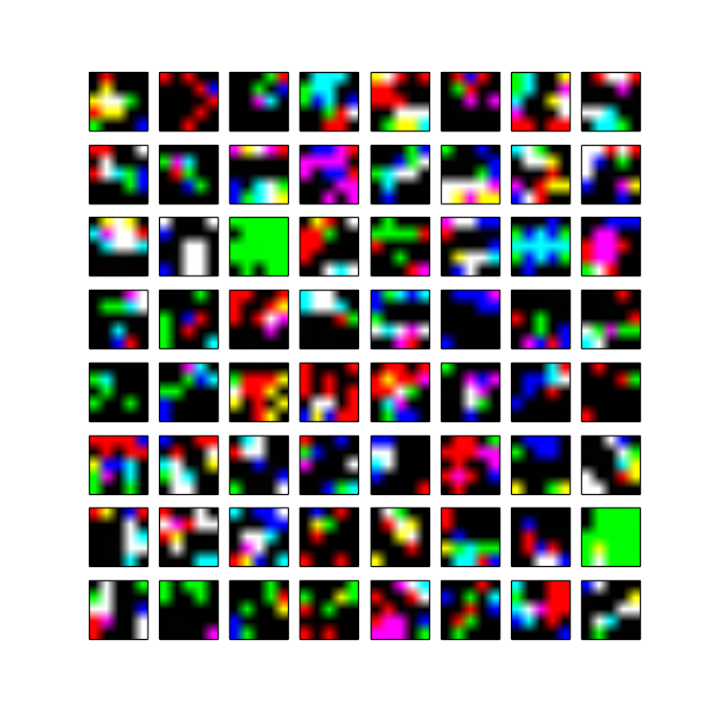

# conv1 filter visualization 

## Settings
- dataset 1: towncenter
- filter size: 3x64x5x5 (in x out x width x height)
- visualize filters learned for 10 locations 

## Notes
- Some of SPNs were not trained very well. For example, at location 8, the weights are mostly zeros. Likewise, location 4 and 6 have many zero values. 
- Before seeing the results, I actually expected that it will show mostly low-level features like gabor filters. I wonder 1) if it is because our task is not just detection nor simply pose estimation, but the combination of many tasks (i.e., detection, pose estimation, segmentation), and 2) what other pose estimation baseline models that are trained correctly will produce. One thing that I would do is check and compare activation maps for layers at multiple stages given some test images.  

## Visualizations
<table>
    <tr> 
        <td> location 1 </td>
        <td> location 2 </td>
        <td> location 3 </td>
    </tr>
    <tr>
        <td>  </td>
        <td>  </td>
        <td>  </td>
    </tr>
    <tr> 
        <td> location 4 </td>
        <td> location 5 </td>
        <td> location 6 </td>
    </tr>
    <tr>
        <td>  </td>
        <td>  </td>
        <td>  </td>
    </tr>
    <tr> 
        <td> location 7 </td>
        <td> location 8 </td>
        <td> location 9 </td>
    </tr>
    <tr>
        <td>  </td>
        <td>  </td>
        <td> 
    </tr>
    <tr> 
        <td> location 10 </td>
    </tr>
    <tr>
        <td>  </td>
    </tr>
</table>

